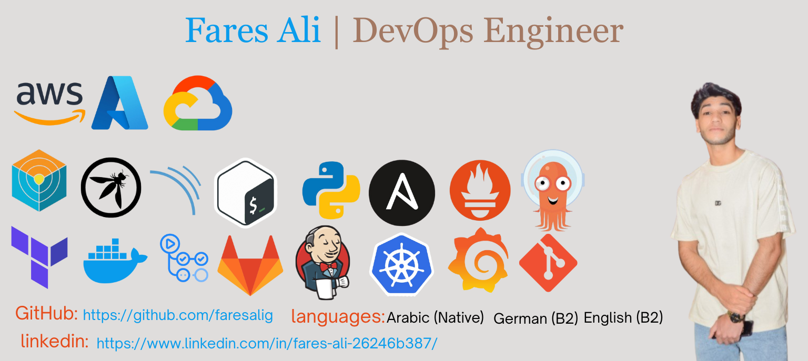

<h1 align="center">Hi 👋 I'm Fares Ali</h1>

  🚀 DevOps Engineer | ☁️ Cloud & Automation Enthusiast | 🤖 Exploring MLOps & AIOps

  

---

## 👨‍💻 About Me

- 💻 DevOps Engineer passionate about **automation, cloud, and CI/CD**
- ☁️ Working with **AWS, Azure, GCP** and modern DevOps tools
- 🐳 Using **Docker** and **Kubernetes** to build and run scalable applications
- 🧱 Writing **Infrastructure as Code** with **Terraform** and **Ansible**
- 🔐 Interested in **security and quality** using **SonarQube, Trivy, OWASP tools**
- 🧪 I enjoy building end to end pipelines from code to production using **GitHub Actions** and **GitLab CI**
- 🐍 Scripting with **Python** and **Bash** to automate repetitive tasks
- 🎯 My goal is to become a strong **DevOps / Cloud Engineer** and help teams ship faster and safer

---

## 🛠️ Tech Stack

### 🚀 DevOps & Cloud

- **Cloud:** AWS · Azure · GCP  
- **Containers & Orchestration:** Docker · Kubernetes  
- **CI/CD:** GitHub Actions · GitLab CI · Jenkins  
- **IaC (Infrastructure as Code):** Terraform · Ansible  
- **Version Control:** Git · GitHub · GitLab  

### 🧪 Code Quality & Security

- **Code Quality & Analysis:** SonarQube  
- **Container Security:** Trivy  
- **Security Practices:** OWASP concepts and guidelines  

### 🧠 MLOps & AIOps (Learning)

- Automating ML workflows  
- Deploying models on cloud  
- Observability and intelligent alerting  

### 💻 Programming & Scripting

- **Languages:** Python · Bash  
- **Use cases:** automation scripts · tools for CI/CD · infra utilities  

---

## 📈 GitHub Stats

  

---

## 🤝 Connect With Me

- 💼 LinkedIn: [LinkedIn](https://www.linkedin.com/in/fares-ali-26246b387)  
- 📧 Email: info@faresdev.com  

Always happy to connect with DevOps, Cloud, and AI enthusiasts 😄
